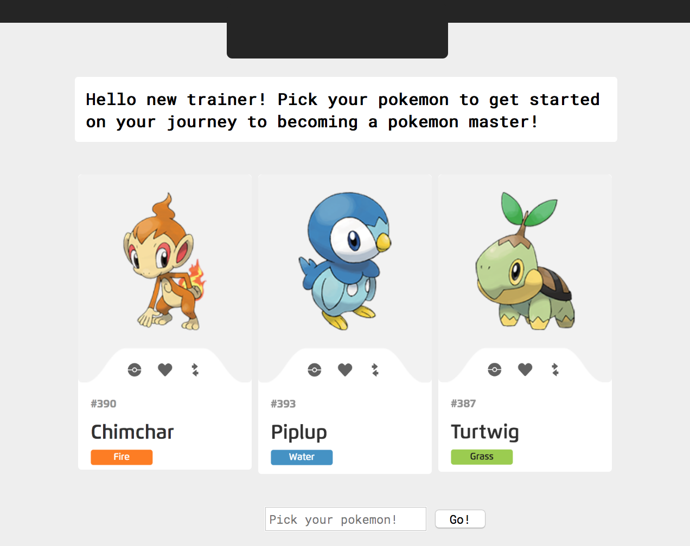

# Pokemon

Hello new trainer!  Choose from the three pokemon before you to being your quest to a pokemon master.

**Link to project:** https://myraha.github.io/Pokemon/

## How It's Made:

**Tech used:** HTML, CSS, JavaScript, Node.js

The index.html contains a heading of the application, a select tag for the different pokemons available on the API, a search button and another heading with 2 span tags for the description of the pokemon.
